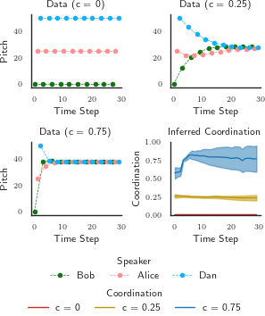

# Probabilistic Modeling of Interpersonal Coordination Processes

## Requirements

To install requirements:

```setup
pip install -r requirements.txt
```

**Note**: To evaluate multiple experiments in parallel, you must have TMUX and Conda installed in the machine and the dependencies above installed in a conda environment called `coordination`.

## Modules

The project splits the general model definition into several modules that are put together to construct a concrete instance of a model of coordination. For example, to create a model with constant coordination and serialized latent component, one can use the modules: ConstantCoordination, SerialComponent, and SerialObservation. The available list of modules are:

- **ConstantCoordination**: Continuous coordination that does not change over time.
- **SigmoidGaussianCoordination**: Coordination with transitions defined by a Gaussian random walk.
- **SerialComponent**: Serial component with dynamics defined by a Gaussian random walk on blended means (pairwise dependency).
- **NonSerialComponent**: Non-serial component with dynamics defined by a Gaussian random walk on blended means (multiple dependencies).
- **SerialObservation**: Gaussian distribution centered on SerialComponent values.
- **NonSerialObservation**: Gaussian distribution centered on NonSerialComponent values.
- **SpikeObservation**: Normal centered at coordination values over time. Used for sparse binary observations (e.g., semantic link) to increase coordination in certain moments.

## Vocalic Model

The project contains a vocalic model (with or without semantic links) that can be used generate data and run inference.

The model has a standard interface and parameterization is done via a dataclass to which we call a config bundle. When implementing your own models, we suggest following this approach for compatibility with the webapp where one can trigger new inference runs, monitor their progresses and see different results including plots and histograms of the inferred latent variables.

To reproduce the image below, execute the commands in `notebooks/Synthetic Vocalic`.



## Inference

We provide a series of `make` commands to run inference jobs to reproduce the results in the paper. Comments are included in the Makefile above each target. Optionally, one can trigger the inferences via the webapp we provide and check the results there.

The commands will run inferences in sequence for each experiment in the dataset. If you wish to split inferences in multiple jobs, set the environment variable `N_JOBS` to the appropriate number. Bear in mind each job spawns 4 others: one for each chain.

The compiled `pytensor` objects will be placed under the folder `.pytensor_compiles` in the project root. This is to avoid errors due to concurrent locks when we try to fit multiple models at the same time. From time to time, you may want to clean that directory to save space. You can change that directory by setting the environment variable `pytensor_comp_dir` before calling the `run_inference` script or the webapp if triggering inferences from there.

## Data

All the data used in the experiments are located in the folder `data/` in the project's root directory. This directory also contains configurations to: 

1. Override the config bundle with specific parameter values we used during experimentation (`data/params/..._params_dict.json`).
2. Map columns in the data to specific fields in the model's config bundle (`data/mappings/..._vocalic_data_mapping.json`).

## Webapp

The project provides a webapp to execute new runs, monitor the progress of such runs and see results of inference jobs (see images below).

To start the app in the port 8080, do:
```
APP_PORT=8080 make app
```

It is possible to run it in a remote server and access it locally via port forwarding. By default, inferences will be saved in the directory `.run/inferences` but one can change that path in the app or via one of the environment variables described below:

- **inferences_dir**: directory where inferences must be saved.
- **data_dir**: directory where datasets are located. 
- **evaluations_dir**: directory where evaluations are located. Every time we run an inference run, it will generate a unique ID (timestamp). Traces will be saved under `$inferences_dir/run_id`. We can add extra evaluation objects (.csv and png) in another directory with the format `$EVAL_DIR/run_id` and they will be available in the Evaluations tab in the app.  


## License

MIT License - Copyright (c) 2023
